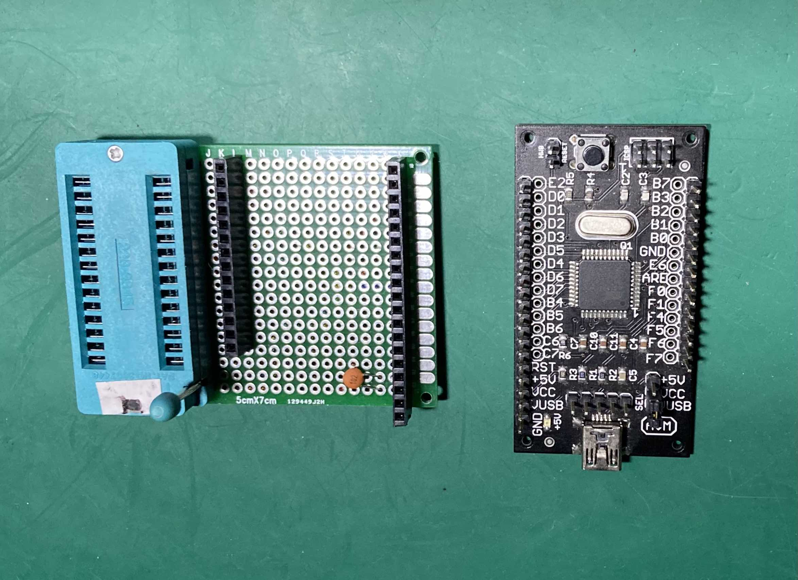
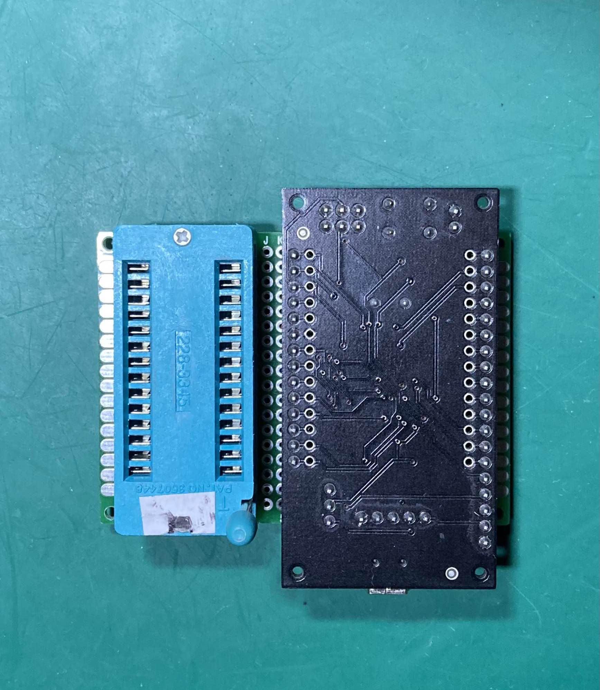
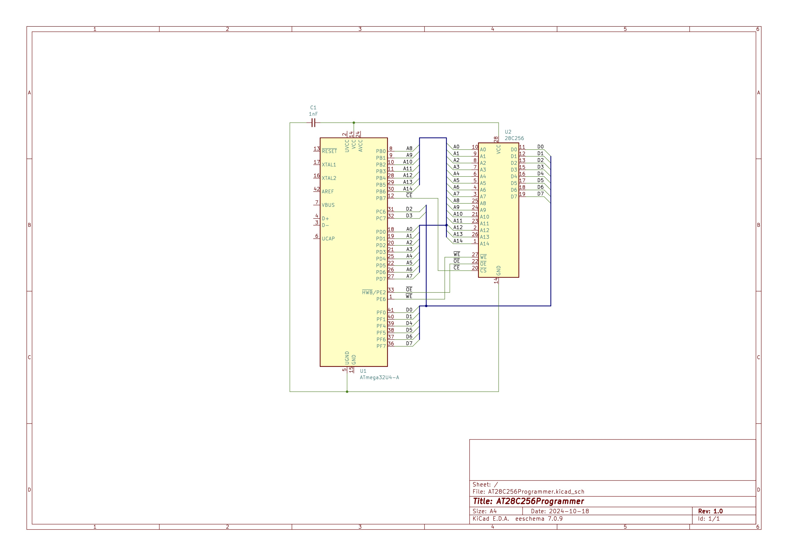

# ATmega32u4 EEPROM Programmer for AT28C256 and compatibles 

This is a simple EEPROM programmer using an ATmega32u4.

I'm building the ZX81+38 clone of the Sinclair ZX81, to use for testing some
external interface boards I'm working on.

The ZX81+38 requires an (E)EPROM, and a ROM programmer. I don't have a ROM programmer but I do have an ATmega32u4 development board that I bought many years ago. The ATmega32u4 is a 5V MCU with 26 GPIOs and this can interface with the 26 signal pins of a AT8C256 (or compatble) EEPROM without the need for additional components, although I added a 1 nF coupling capacitor. I do not remember where I bought this Atmega32u4 board, and I cannot find any documentation on this particular board on the Internet. 

This project makes use of Dean Camera's excellent [LUFA USB stack](www.lufa-lib.org) to take advantage of the built-in USB support of the 
ATmega32u4. I copied the communication code using ringbuffers from the
[ATmega16u2 firmware project](https://github.com/KITcar-Team/kitcar-usbserial).
And finally, I used the [ATmega8 EEPROM programmer](https://github.com/wagiminator/ATmega-EEPROM-Programmer) as inspiration. The latter project requires shift registers to implement the parallel operation of the programmer and it uses the Arduino development system. In contrast, this project requires no additional components because the ATmega32u4 provides exactly the required 
number of GPIOs and it uses the avr-gcc framework.

The programmer can also be used to test RAM chips that have a pinout and
timing that is compatible with the AT28C256.


## Usage

### Overview

The ATmega32u4 MCU is used as a USB-connected programmer. It receives commands
to read or write bytes to a given address from the host computer over a serial connection and communicates to the ROM or RAM chip. When writing a byte it
will read back the value after writing to the address and return that to the host computer.

No attempt was made to optimize the speed of programming the ROM chips. The programmer writes each address individually and does not use block write operations. Writing a 32KiB takes only about 30 seconds and that seems fast enough for occasional use. Slower write operations are indicative of write errors.

Two Python scripts are provided that can send commands to the programmer. These scripts are used to upload or download blocks of data from the ROM and to test a ROM or RAM chip by writing and reading back different values to the ROM or RAM chip:

```
usage: AT28C256Programmer [-h] -d DEVICE [-i INPUT_FILE] [-o OUTPUT_FILE]
                          [-a ADDRESS] [-s SIZE] [-E] [-D]

Program an AT28C256 or compatible ROM chip using an Atmega32u4. Use the
-d/--device option to specify the serial device. Use the -i/--input_file
option to upload to the ROM. Use the -o/--output_file option to download from
the ROM. The -a/--adress option specifies the start address. This is optional
and defaults to 0. The -s/--size option specifies the size of the
upload/download. This is optional and defaults to the size of input file for
uploads and up to the end of the ROM's 32KB address space for downloads.

options:
  -h, --help            show this help message and exit
  -d DEVICE, --device DEVICE
                        The USB serial device for accessing the programmer.
  -i INPUT_FILE, --input_file INPUT_FILE
                        The ROM file to be uploaded.
  -o OUTPUT_FILE, --output_file OUTPUT_FILE
                        The file where to save the download.
  -a ADDRESS, --address ADDRESS
                        The start address for the upload or download.
  -s SIZE, --size SIZE  The size of the upload or download.
  -E, --sdp_enable      Enable the software data protection after uploading.
  -D, --sdp_disable     Disable the software data protection before uploading.

```

This script supports disabling and enabling the Software Data Protection for AT28C256 ROM chips. The cheaper chips available on Ebay and from Chinese sellers are pre-owned and may have SDP enabled, as did the one I bought.

Note that one should always use the `-s` option when programming a ROM chip that has less than 32KiB capacity. For instance, use `-s 8192` when programming an AT28C64 EEPROM.

```

usage: RWTester [-h] -d DEVICE [-r REFERENCE] [-a ADDRESS] [-s SIZE] [-m MASK]

Test a ROM or RAM chip using an Atmega32u4. The ROM or RAM must be compatible
with the AT28C256 ROM chip. The program writes values to the ROM or RAM and
reads them back. The observed values are checked against the values that were
written. Use the -d/--device option to specify the USB serial device. The
-r/--reference option can be used to specify a file to compare to the contents
of the the ROM. The -a/--address option specifies the start address. This is
optional and defaults to 0. The -s/--size option specifies the size of the
block to test. This is optional and defaults 32KB. The optional argument
-m/--mask is an 8-bit integer that represents a bit mask. Only the bits that
are set in this mask are used in the comparisons.

options:
  -h, --help            show this help message and exit
  -d DEVICE, --device DEVICE
                        The USB serial device for accessing the programmer.
  -r REFERENCE, --reference REFERENCE
                        Compare the ROM contents against the given file.
  -a ADDRESS, --address ADDRESS
                        The start address for the test.
  -s SIZE, --size SIZE  The size of the block to test (in bytes).
  -m MASK, --mask MASK  Compare using the provided mask.
```

## Construction

The programmer was constructed on a small piece of protoboard using a ZIF socket and female headers. The ATmega32u4 development board had the pins soldered on top and it is therefore inserted upside-down in the headers:




The programmer uses the available GPIO pins of port C and port F to connect to the datapins:

| GPIO 	| Data bus |
|---------|---------|
| F0		| D0		|
| F1		| D1		|
| C6		| D2		|
| C7		| D3		|
| F4		| D4		|
| F5		| D5		|
| F6		| D6		|
| F7		| D7		|

The address bus uses ports D and B:

| GPIO 	| Address bus |
|---------|---------|
| D0		| A0		|
| D1		| A1		|
| D6		| A2		|
| D7		| A3		|
| D4		| A4		|
| D5		| A5		|
| D6		| A6		|
| D7		| A7		|
| B0		| A8		|
| B1		| A9		|
| B2		| A10		|
| B3		| A11		|
| B4		| A12		|
| B5		| A13		|
| B6		| A14		|


The control signals make use of the remaning pins of port B and port E:

| GPIO 	| Signal  |
|---------|---------|
| B7		| /CE		|
| E2		| /OE		|
| E6		| /WE		|



## Building and installing the project

### Firmware

To build this project, you will need to have the avr-gcc toolchain installed.
I used the [Mac OS AVR toolchain](https://github.com/beustens/avr-gcc_mac_toolchain.git). The directory that contains the executables must be added to your `PATH` environment variable.

LUFA can be downloaded from the [LUFA Github repository](https://github.com/abcminiuser/lufa.git). You should set the `LUFA_PATH` environment variable to the `LUFA` subdirectory of the repository. 

I installed the DFU programmer tool using [MacPorts](https://www.macports.org/):

```
$> sudo port install dfu-programmer
```

You will also need `make`. On MacOs this is installed as part of the XCode command line tools.

Build the project by running:

```
$> make
```

in the root directory of the project.

Attach the ATmega32u4 in DFU mode (HWB shorted when resetting the device) and 
program the device by running:

```
$> make dfu
```

### Python modules

The Python install package for Python3 is available in the `dist` subdirectory as a Python wheel. Install this using `pip3`:

```
$> pip3 install dist/at28c256programmer-0.1.0-py3-none-any.whl
```

This installs the pPython modules and the Python scripts.


 